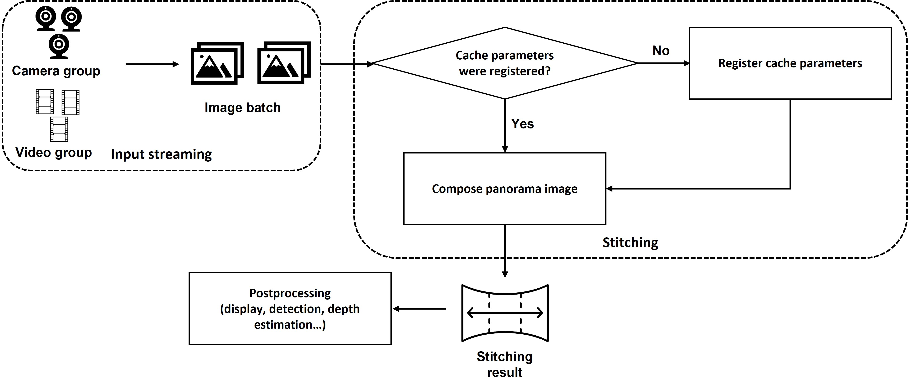
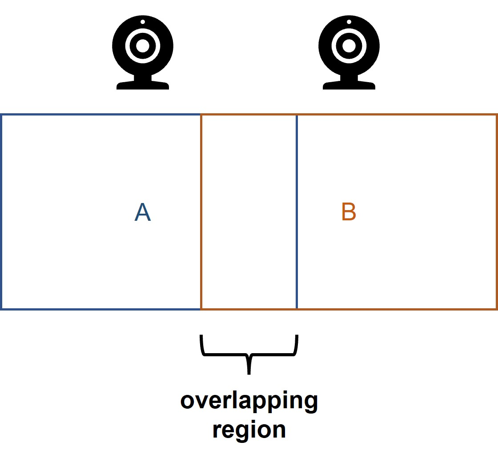
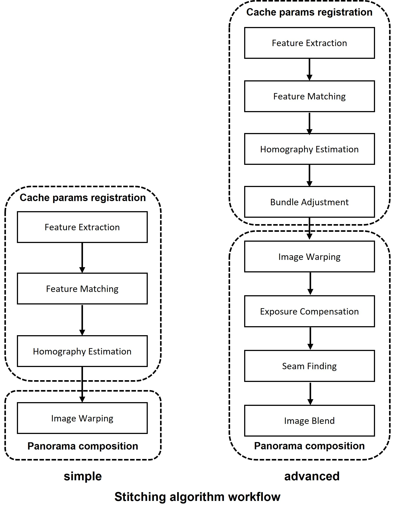
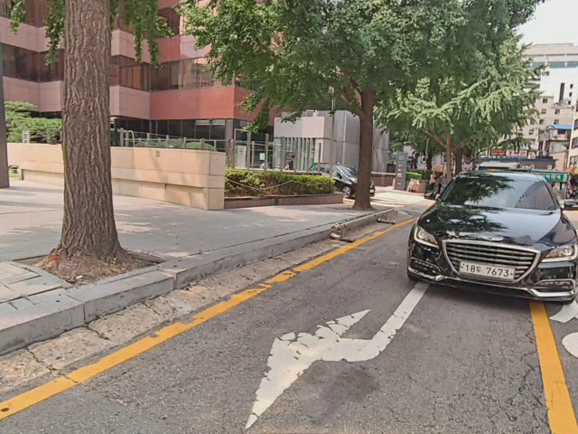
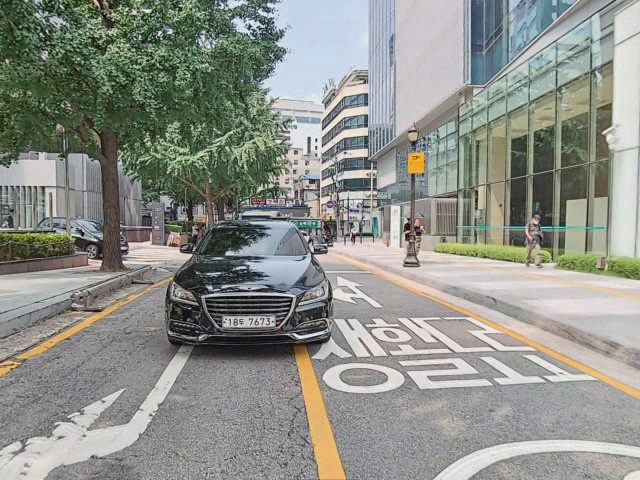
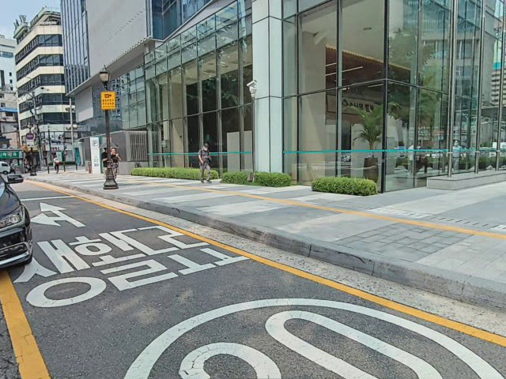
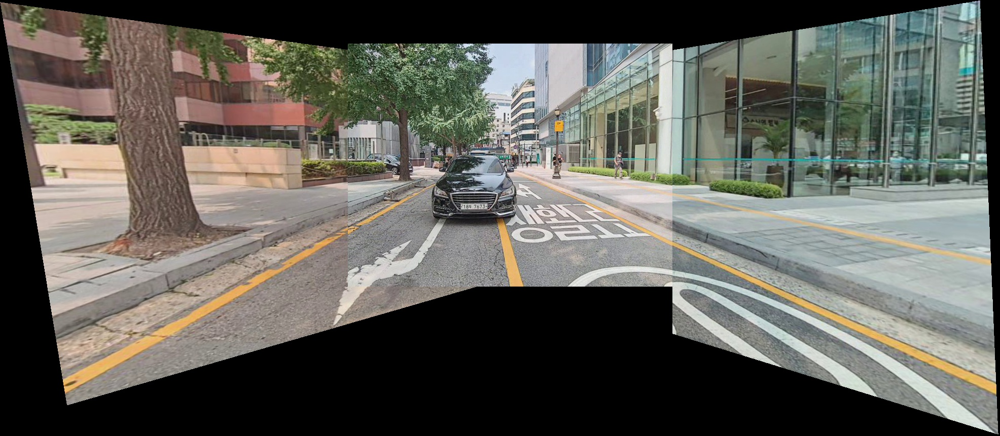
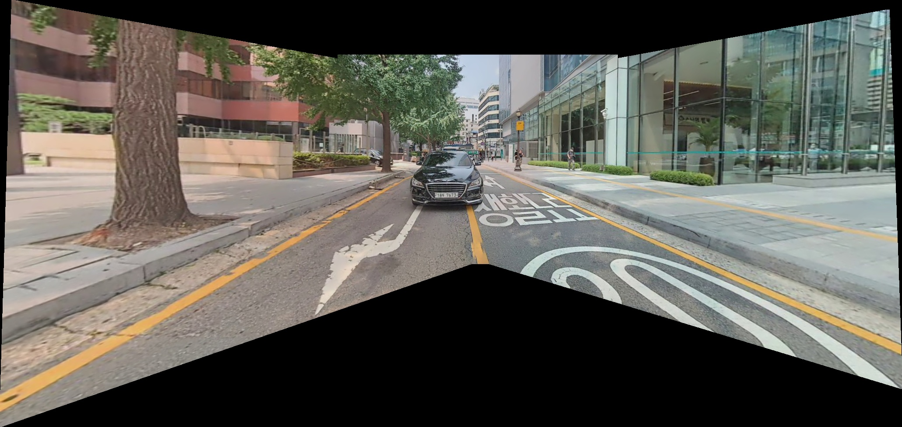

# Introduction


([Image source](https://developer.ridgerun.com/wiki/index.php/Image_Stitching_for_NVIDIA_Jetson/Image_Stitching_for_NVIDIA_Jetson_Basics))


The stitching pipeline includes three phases:

- **Input streaming**: at the beginning, the streaming sources (cameras/videos) are captured. And the image batch will be streamed as an input for the stitching algorithm.
- **Stitching**:
    - **Cache parameters registration**: register the necessary cache parameters. In this step, we should make sure that image from every camera contributes to the estimation.
    - **Panorama composition**: the panorama image is composed from the input image batch and the cache parameters.
- **Postprocessing**: the retrieved panorama image can be used for further processing, such as displaying, detection, or depth estimation, etc.

The entire pipeline is illustrated as below:


```Rule of thumb: the Field-of-View Intersection-over-Union ratio between each camera pair should be at least 30% to overcome lens distortion and have enough detectable features for stitching.```



# Stitching algorithms

We have two different stitching algorithms for the demonstration. The first algorithm (called simple version) follows a simpler workflow, whereas the second one (called advanced version) has a more complicated workflow as it aims to make a much "smoother" result, comes along with a larger inference time. These algorithms are briefly described in the above figure.



Given the same input set including 3 images as below, we will show the stitching result of each stitching algorithm in the following sections:







## 1. Simple algorithm

This algorithm is based on [ImageStitching](https://github.com/WillBrennan/ImageStitching/tree/3fc8ec0a765413bb4cecb15c226cc1c3984e2fb4). The stitching result is as below:



## 2. Advanced algorithm

This algorithm is based on [the OpenCV Stitcher algorithm](https://docs.opencv.org/4.x/StitchingPipeline.jpg) with some adjustments to improve the performance on real-time application. The stitching result is as below:



# Repository structure
    .
    ├── simple    # Utility files for simple stitching algorithm
    |      ├─── datasets.py           # Dataset generation class
    |      ├─── matcher.py            # Matcher class 
    |      ├─── stitcher.py           # Stitcher class 
    ├── stitching_realtime_simple.py   # Script to run real-time stiching using Stitcher's simple algorithm
    ├── stitching_videos_simple.py   # Script to run video stiching using simple algorithm

    ├── advanced    # Utility files for advanced stitching algorithm
    |      ├─── datasets.py           # Dataset generation class
    |      ├─── matcher.py            # Matcher class 
    |      ├─── stitcher.py           # Stitcher class 
    ├── stitching_realtime_advanced.py   # Script to run real-time stiching using Stitcher's advanced algorithm
    ├── stitching_videos_advanced.py   # Script to run video stiching using advanced algorithm

    ├── detect     # Utility files to run detection demo
    |      ├─── utils
    |             ├─── __init__.py
    |             ├─── datasets.py  # Dataset generation class
    |             ├─── general.py
    |             ├─── layers.py
    |             ├─── loss.py
    |             ├─── parse_config.py
    |             ├─── plots.py
    |             ├─── torch_utils.py
    |      ├─── yolov7      # Inference model
    |             ├─── coco.names
    |             ├─── yolov7-tiny.cfg
    |             ├─── yolov7-tiny.weights
    |      ├─── __init__.py
    |      ├─── models.py
    ├── detect.py   # Script to run detection demo
    
    ├── tracker.py   # Utility functions to run depth estimation & object tracking demo
    ├── depth.py     # Script to run depth estimation & object tracking demo

    ├── environment.yaml    # Environment file (Recommended for Linux)
    ├── requirements.txt    # Environment file (Recommended for Windows)
    
    ├── img
    |    ├─── left.jpg
    |    ├─── rear.jpg
    |    ├─── right.jpg

    |    ├─── stitching_simple.jpg
    |    ├─── stitching_advanced.jpg

    |    ├─── Pipeline.jpg
    |    ├─── Pipeline_general.jpg
    |    ├─── Workflow.jpg
    |    ├─── ROI.jpg
    |    ├─── Stitcher_animated_steps.gif

    ├── .gitignore

    ├── README.md
    .

# Installation
## Linux
- Create a new environment using Anaconda:

    ```conda env create -f environment.yaml```
- Activate the environment:

    ```conda activate stitching```

- To run depth.py, norfair is needed: 

    ```pip install norfair```
## Windows
- Create a new environment using Anaconda:
    
    ```conda create -n [name]```
- Activate the environment:

    ```conda activate [name]```
- Install necessary dependencies:

    ```pip install -r requirements.txt```
- Uninstall opencv-python-headless:

    ```pip uninstall opencv-python-headless```

# Usage

## Note
- You can skip any parameter which has a default value.
- On Windows, the camera indices are set as 0, 1, 2..., whereas on Linux, the camera indices are set as 0, 2, 4...
- The stitching algorithms were intentionally developed to work on any number of cameras (at least 2 cameras). We have tested with 4 cameras on laptop computers (Windows, Ubuntu).
- On Ubuntu, the camera indices will be set as the order of cameras plugging into the computer.

## 1. Video stitching
### **1.1. stitching_videos_simple.py (simple algorithm)** 

Run the script with the below command:

```
python stitching_videos_simple.py --sources [sources] --original [original] --output_path [output_path] --feature [feature] --matching [matching] --retention_thres [retention_thres] --reprojection_thres [reprojection_thres] --minimum_match_thres [minimum_match_thres]
```
where:

- **sources**: video file paths
- **original**: show original video (True) or not (False). Default value is False.
- **output_path**: where to save output. Default value is '' (no save output).
- **feature**: a feature extractor method selection. The following methods are supported:
    + 0: [AKAZE](http://www.bmva.org/bmvc/2013/Papers/paper0013/paper0013.pdf)
    + 1: [BRISK](https://margaritachli.com/papers/ICCV2011paper.pdf)
    + 2: [KAZE](https://www.doc.ic.ac.uk/~ajd/Publications/alcantarilla_etal_eccv2012.pdf)
    + 3: [ORB](https://ieeexplore.ieee.org/document/6126544)
    + 4: [SIFT](https://link.springer.com/article/10.1023/B:VISI.0000029664.99615.94) (default)
- **matching**: a homography matrix computation method selection. The following methods are supported:
    + 0: least squares method
    + 1: [RANSAC-based robust method](https://dl.acm.org/doi/10.1145/358669.358692) (default)
    + 2: [Least-Median robust method](https://web.ipac.caltech.edu/staff/fmasci/home/astro_refs/LeastMedianOfSquares.pdf)
    + 3: [PROSAC-based robust method](https://link.springer.com/article/10.1007/BF01933667)
- **retention_thres**: feature matching retention threshold. The default value is 0.3 for ORB and 0.65 for other feature types.
- **reprojection_thres**: a maximum allowed reprojection error to treat a point pair as an inlier. The default value is 4.
- **minimum_match_thres**: minimum number of matched points to be considered as a good match for cached homography estimation. Default value is 10. 

example:

```
python stitching_videos_simple.py --sources vid0.mp4,vid1.mp4,vid2.mp4 --original --output_path stitching.mp4 --feature 4 --matching 1 --retention_thres 0.7 --reprojection_thres 4 --minimum_match_thres 10
```

Press Q on the keyboard to exit the stream.

### **1.2. stitching_videos_advanced.py (advanced algorithm)**

Run the script with the below command:

```
python stitching_videos_advanced.py --sources [sources] --original [original] --output_path [output_path] --feature [feature] --thres [thres]
```
where:

- **sources**: video file paths
- **original**: show original video (True) or not (False). Default value is False.
- **output_path**: where to save output. Default value is '' (no save output).
- **feature**: a feature extractor method selection. The following methods are supported:
    + 0: [AKAZE](http://www.bmva.org/bmvc/2013/Papers/paper0013/paper0013.pdf)
    + 1: [BRISK](https://margaritachli.com/papers/ICCV2011paper.pdf)
    + 2: [KAZE](https://www.doc.ic.ac.uk/~ajd/Publications/alcantarilla_etal_eccv2012.pdf)
    + 3: [ORB](https://ieeexplore.ieee.org/document/6126544) (default)
    + 4: [SIFT](https://link.springer.com/article/10.1023/B:VISI.0000029664.99615.94) 
- **thres**: feature matching retention threshold. The default value is 0.3 for ORB and 0.65 for other feature types.

example:

```
python stitching_videos_advanced.py --sources vid0.mp4,vid1.mp4,vid2.mp4 --original --output_path result.mp4 --feature 4 --thres 0.7
```

Press Q on the keyboard to exit the stream.

## 2. Real-time stitching
### **2.1. stitching_realtime_simple.py (simple algorithm)** 

Run the script with the below command:

```
python stitching_realtime_simple.py --sources [sources] --original [original] --output_path [output_path] --feature [feature] --matching [matching] --retention_thres [retention_thres] --reprojection_thres [reprojection_thres] --minimum_match_thres [minimum_match_thres]
```
where:

- **sources**: camera index list (on Windows it will be 0, 1, 2...., whereas on Linux it will be 0, 2, 4...)
- **original**: show original video (True) or not (False). Default value is False.
- **output_path**: where to save output. Default value is '' (no save output).
- **feature**: a feature extractor method selection. The following methods are supported:
    + 0: [AKAZE](http://www.bmva.org/bmvc/2013/Papers/paper0013/paper0013.pdf)
    + 1: [BRISK](https://margaritachli.com/papers/ICCV2011paper.pdf)
    + 2: [KAZE](https://www.doc.ic.ac.uk/~ajd/Publications/alcantarilla_etal_eccv2012.pdf)
    + 3: [ORB](https://ieeexplore.ieee.org/document/6126544)
    + 4: [SIFT](https://link.springer.com/article/10.1023/B:VISI.0000029664.99615.94) (default)
- **matching**: a homography matrix computation method selection. The following methods are supported:
    + 0: least squares method
    + 1: [RANSAC-based robust method](https://dl.acm.org/doi/10.1145/358669.358692) (default)
    + 2: [Least-Median robust method](https://web.ipac.caltech.edu/staff/fmasci/home/astro_refs/LeastMedianOfSquares.pdf)
    + 3: [PROSAC-based robust method](https://link.springer.com/article/10.1007/BF01933667)
- **retention_thres**: feature matching retention threshold. The default value is 0.3 for ORB and 0.65 for other feature types.
- **reprojection_thres**: a maximum allowed reprojection error to treat a point pair as an inlier. The default value is 4.
- **minimum_match_thres**: minimum number of matched points to be considered as a good match for cached homography estimation. Default value is 10. 

example:

```
python stitching_realtime_simple.py --sources 0,1,2 --original --save  --output_path stitching.mp4 --feature 4 --matching 1 --retention_thres 0.7 --reprojection_thres 4 --minimum_match_thres 10
```

Press Q on the keyboard to exit the stream.

### **2.2. stitching_realtime_advanced.py (advanced algorithm)**

Run the script with the below command:

```
python stitching_realtime_advanced.py --sources [sources] --original [original] --output_path [output_path] --feature [feature] --thres [thres]
```
where:

- **sources**: camera index list (on Windows it will be 0, 1, 2...., whereas on Linux it will be 0, 2, 4...)
- **original**: show original video (True) or not (False). Default value is False.
- **output_path**: where to save output. Default value is '' (no save output).
- **feature**: a feature extractor method selection. The following methods are supported:
    + 0: [AKAZE](http://www.bmva.org/bmvc/2013/Papers/paper0013/paper0013.pdf)
    + 1: [BRISK](https://margaritachli.com/papers/ICCV2011paper.pdf)
    + 2: [KAZE](https://www.doc.ic.ac.uk/~ajd/Publications/alcantarilla_etal_eccv2012.pdf)
    + 3: [ORB](https://ieeexplore.ieee.org/document/6126544) (default)
    + 4: [SIFT](https://link.springer.com/article/10.1023/B:VISI.0000029664.99615.94) 
- **thres**: feature matching retention threshold. The default value is 0.3 for ORB and 0.65 for other feature types.

example:

```
python stitching_realtime_advanced.py --sources 0,1,2 --original --output_path result.mp4 --feature 4 --thres 0.7
```

Press Q on the keyboard to exit the stream.

## 3. Stitching (supports both real-time camera stitching and/or video stitching) + Object detection (YOLOv7-tiny)
Run the script detect.py with the below command:

```
python detect.py --sources [sources]  --device [device] --original [original] --output_path [output_path] --classes [classes] --cfg [cfg] --weights [weights] --names [names] --conf_thres [conf_thres] --iou_thres [iou_thres] --feature [feature] --thres [thres] 
```
where:

- **sources**: list of camera indices and/or video file paths (on Windows the camera indices will be 0, 1, 2...., whereas on Linux it will be 0, 2, 4...)
- **device**: cuda device, i.e. 0 or 0,1,2,3 or ''(cpu). Default is ''.
- **original**: show original video (True) or not (False). Default is True.
- **output_path**: where to save output. Default value is '' (no save output).
- **conf_thres**: object confidence threshold. Default is 0.4.
- **iou_thres**: IOU threshold for NMS. Default is 0.5.
- **classes**: filter by class: --class 0, or --class 0 2 3. Default all classes are inspected.
- **cfg**: path to the .cfg file. Default is [detect\yolov7\yolov7-tiny.cfg](detect\yolov7\yolov7-tiny.cfg)
- **weights**: path to the .weights file. Default is [detect\yolov7\yolov7-tiny.weights](detect\yolov7\yolov7-tiny.weights)
- **names**: path to the .names file. Default is [detect\yolov7\coco.names](detect\yolov7\coco.names)
- **feature**: a feature extractor method selection. The following methods are supported:
    + 0: [AKAZE](http://www.bmva.org/bmvc/2013/Papers/paper0013/paper0013.pdf)
    + 1: [BRISK](https://margaritachli.com/papers/ICCV2011paper.pdf)
    + 2: [KAZE](https://www.doc.ic.ac.uk/~ajd/Publications/alcantarilla_etal_eccv2012.pdf)
    + 3: [ORB](https://ieeexplore.ieee.org/document/6126544)  (default)
    + 4: [SIFT](https://link.springer.com/article/10.1023/B:VISI.0000029664.99615.94)
- **thres**: feature matching retention threshold. The default value is 0.3 for ORB and 0.65 for other feature types.
Example:
```
python detect.py --sources 0,1,2 --weights detect\yolov7\yolov7-tiny.weights --cfg detect\yolov7\yolov7-tiny.cfg --names detect\yolov7\coco.names --device 0 --original --output_path demo.mp4 --class 0 --conf_thres 0.4 --iou_thres 0.5 --feature 4 --thres 0.7
```

Press Q on the keyboard to exit the stream.

## 4. Stitching (supports both real-time camera stitching and/or video stitching) + Depth estimation (MiDaS) + Object detection (YOLOv5s) + Object tracking (Norfair)

Run the script depth.py with the below command:

```
python depth.py --sources [sources] --device [device] --original [original] --output_path [output_path] --model_type [model_type] --feature [feature] --thres [thres]
```

where:

- **sources**: list of camera indices and/or video file paths (on Windows the camera indices will be 0, 1, 2...., whereas on Linux it will be 0, 2, 4...)
- **device**: cuda device, i.e. 0 or 0,1,2,3 or cpu (''). Default is ''.
- **original**: show original video (True) or not (False). Default is True.
- **output_path**: where to save output. Default value is '' (no save output).
- **model_type**: depth estimation model type: DPT_Large (default), DPT_Hybrid or MiDaS_small.
- **feature**: a feature extractor method selection. The following methods are supported:
    + 0: [AKAZE](http://www.bmva.org/bmvc/2013/Papers/paper0013/paper0013.pdf)
    + 1: [BRISK](https://margaritachli.com/papers/ICCV2011paper.pdf)
    + 2: [KAZE](https://www.doc.ic.ac.uk/~ajd/Publications/alcantarilla_etal_eccv2012.pdf)
    + 3: [ORB](https://ieeexplore.ieee.org/document/6126544)  (default)
    + 4: [SIFT](https://link.springer.com/article/10.1023/B:VISI.0000029664.99615.94)
- **thres**: feature matching retention threshold. The default value is 0.3 for ORB and 0.65 for other feature types.

Example:
```
python depth.py --sources 0,1,2 --device 0 --original --save --output_path demo.mp4 --model_type MiDaS_small --feature 4 --thres 0.7
```

Press Q on the keyboard to exit the stream.
